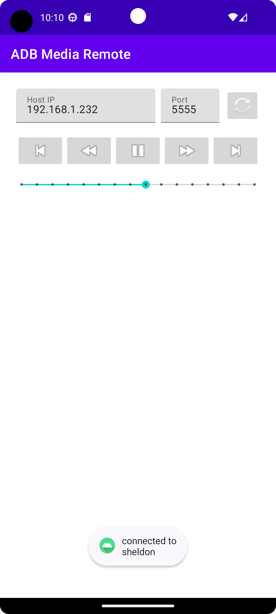

# ADB Media Remote

ADB Media Remote is a simple application to remote control Android device media playback using ADB commands.

Tested using Amazon Fire TV Stick lite (Android 9).
Newer android versions may not provide the media commandline tool.

Following commands are:

```bash
media dispatch [play-pause, next, previous, rewind, fast-forword]
media volume --get
media volume --set INDEX
```

